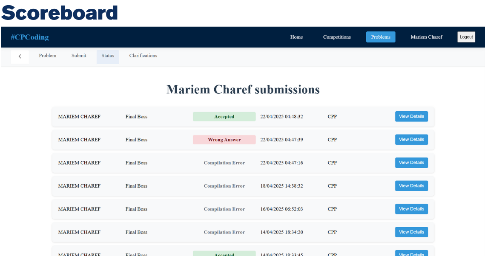
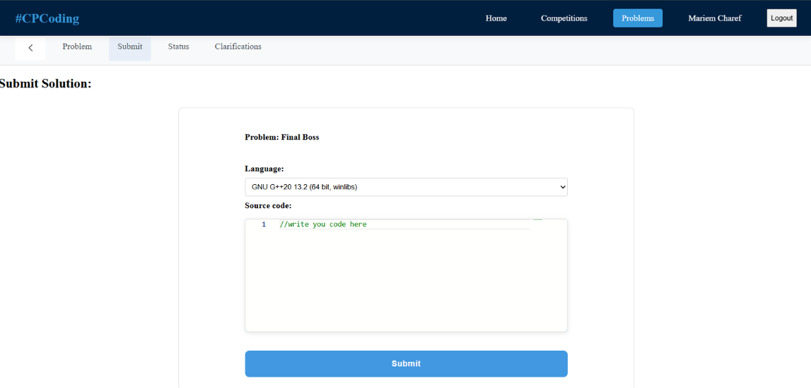
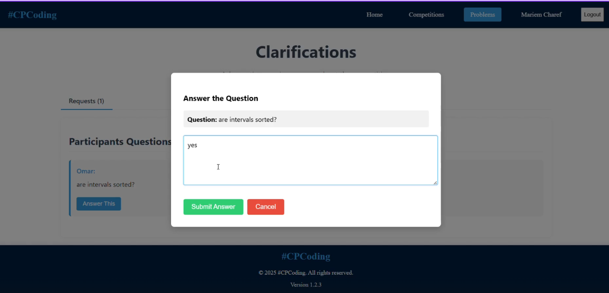
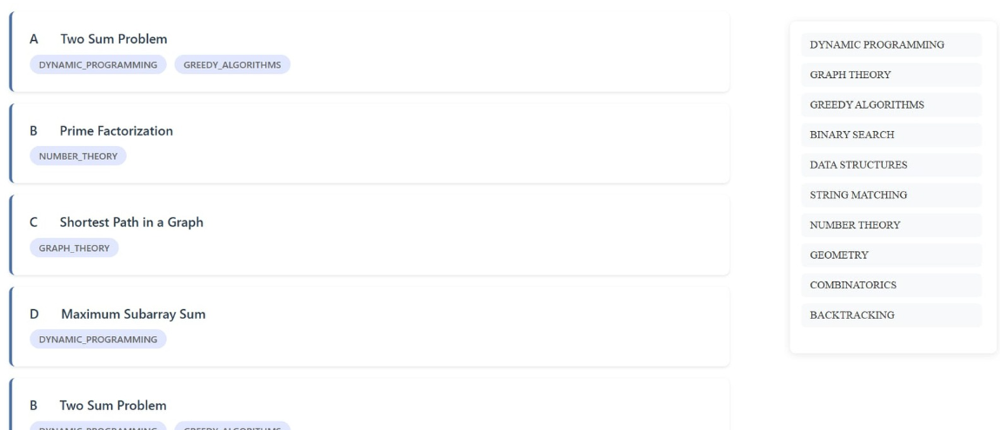

# 🚀 Contest Management Platform (Codeforces-like)

A full-stack platform for managing programming contests, featuring real-time scoreboards, code editor with compilation, problem statements, and clarifications system.  
Built with **ReactJS** (frontend) and **Spring Boot + PostgreSQL** (backend).

## ✨ Features
- 📊 Real-time **Scoreboard**
- 📝 Built-in **Code Editor** with language support
- ❓ **Clarification Page** for contest Q&A
- 📚 **Problems Page** with statement, input/output, and submissions
- 👥 User authentication

 ## 📸 Screenshots

### 🔹 Scoreboard

### 🔹 Code Editor

### 🔹 Clarification Page

### 🔹 Problems Page

### 🔹 Submission Details Page

## 🛠 Tech Stack
- **Frontend:** ReactJS
- **Backend:** Spring Boot (Java)
- **Database:** PostgreSQL
- **Other:** JWT Authentication
  
